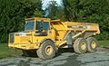

#  Dumper


[](https://travis-ci.org/carldata/dumper)

Application for storing data from Kafka to Cassandra.

 
## Running test
 
 ```bash
sbt assembly
java -jar target/scala-2.12/dumper.jar 
 ```
 
# Redistributing

Dumper source code is distributed under the Apache-2.0 license.

**Contributions**

Unless you explicitly state otherwise, any contribution intentionally submitted
for inclusion in the work by you, as defined in the Apache-2.0 license, shall be
licensed as above, without any additional terms or conditions.
